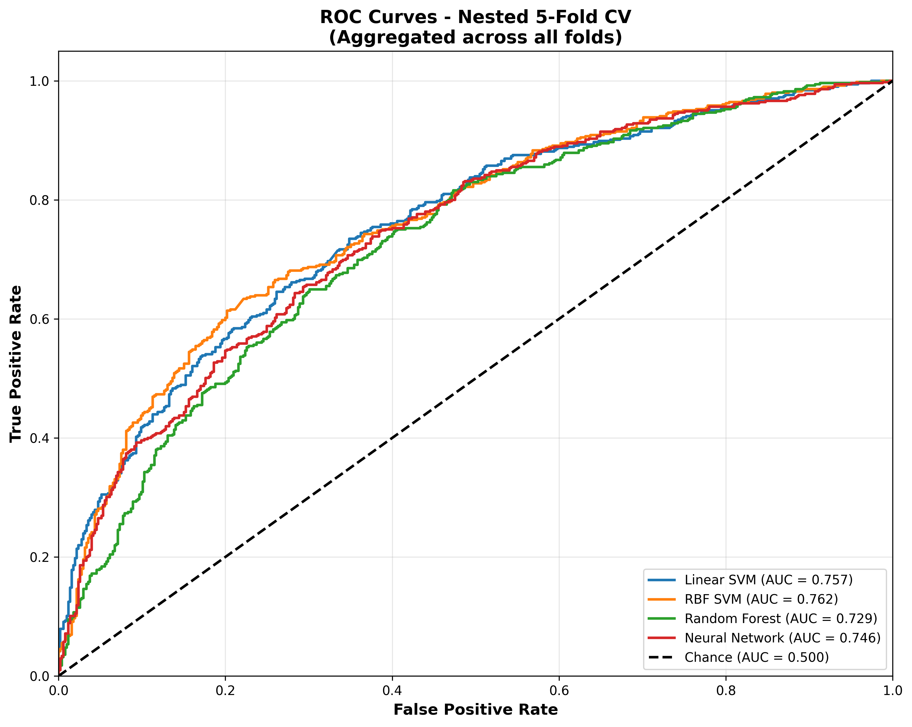

# Methodology: Nested Cross-Validation for ASD Classification

## Data Preprocessing

• **Dataset**: ABIDE-I (Autism Brain Imaging Data Exchange) with data from **17 independent acquisition sites** across North America and Europe

• **Sample Size**: 1,010 participants after balancing (505 ASD, 505 Controls)

• **Feature Extraction**: Extracted upper-triangular elements from correlation matrices (CC200 atlas), yielding 19,900 connectivity features for each participant

• **Class Balancing**: Balanced the dataset by removing excess control samples using site-stratified random sampling to maintain proportional representation across acquisition sites

• **Final Dataset**: Balanced dataset with equal numbers of ASD and control participants

## Model Selection

Four classification models were evaluated:

1. **Linear Support Vector Machine (SVM)**: Default hyperparameters (C=1.0, no PCA)
2. **RBF Kernel SVM**: Optimized hyperparameters (C, gamma, PCA components)
3. **Random Forest**: Optimized hyperparameters (n_estimators, max_depth, min_samples_split, min_samples_leaf, max_features, PCA components)
4. **Neural Network**: Two hidden-layer architecture with optimized hyperparameters (hidden layer dimensions, dropout rate, learning rate, weight decay, batch size, PCA components)

## Nested Cross-Validation Procedure

### Outer Loop (5-Fold Cross-Validation)

• **Data Splitting**: Balanced dataset divided into 5 folds using stratified sampling based on both site ID and diagnostic label

• **Purpose**: Provide unbiased performance estimates on completely held-out data

• **Each Outer Fold**:
  - Training set: 80% of data
  - Testing set: 20% of data (held out for final evaluation)

### Inner Loop (Hyperparameter Optimization)

For each outer fold's training set (80%):

• **Optimization Framework**: Optuna with Tree-structured Parzen Estimator (TPE) sampler

• **Number of Trials**: 30 trials per model (except Linear SVM which uses default parameters)

• **Validation Strategy**: 5-fold stratified cross-validation on the training set, stratified by site ID and diagnostic label

• **Optimization Metric**: Area Under the Receiver Operating Characteristic Curve (AUC-ROC)

• **Hyperparameter Search Spaces**:
  - **RBF SVM**: C ∈ [10⁻³, 10²], gamma ∈ [10⁻⁵, 10⁻¹], PCA components ∈ [10, max_allowable]
  - **Random Forest**: n_estimators ∈ [100, 1000], max_depth ∈ [5, 50], min_samples_split ∈ [2, 20], min_samples_leaf ∈ [1, 10], max_features ∈ {sqrt, log2, None}, PCA components ∈ [10, max_allowable]
  - **Neural Network**: hidden_dim1 ∈ [64, 512], hidden_dim2 ∈ [32, 256], dropout_rate ∈ [0.1, 0.7], learning_rate ∈ [10⁻⁵, 10⁻²], weight_decay ∈ [10⁻⁶, 10⁻³], batch_size ∈ {16, 32, 64}, PCA components ∈ [10, max_allowable]

### Model Training and Evaluation

For each outer fold:

1. **Feature Standardization**: Applied StandardScaler fit on training set, transformed both training and test sets

2. **Dimensionality Reduction**: Applied PCA (when optimized) using components determined by inner loop optimization

3. **Model Training**: Trained model on full training set (80%) using optimal hyperparameters from inner loop

4. **Model Evaluation**: Evaluated on held-out test set (20%) to compute accuracy and AUC-ROC

5. **Neural Network Specifics**: 
   - Used 20% of training data for validation during training
   - Implemented early stopping with patience of 10 epochs
   - Maximum 100 training epochs
   - Binary cross-entropy with logits loss function
   - Adam optimizer

## Performance Metrics

• **Primary Metrics**: 
  - Accuracy: Proportion of correct classifications
  - AUC-ROC: Area under the receiver operating characteristic curve

• **Aggregation**: Computed mean and standard error across 5 outer folds for each model

• **Statistical Reporting**: Results reported as Mean ± Standard Error (SE)

## Implementation Details

• **Random Seeds**: Fixed random seeds (42 for data splitting, 42 for model training) to ensure reproducibility

• **Software**: 
  - Python 3.x
  - scikit-learn for traditional ML models and preprocessing
  - PyTorch for neural network implementation
  - Optuna for hyperparameter optimization

• **Computational Resources**: Models trained with parallelization where applicable (Random Forest: n_jobs=-1)

## Rationale

This nested cross-validation approach provides:

1. **Unbiased Performance Estimates**: Outer loop test sets never seen during hyperparameter optimization

2. **Robust Hyperparameter Selection**: Inner loop uses cross-validation to avoid overfitting to a single validation split

3. **Generalization Assessment**: Five independent test sets provide reliable estimate of model performance with quantified uncertainty

4. **Fair Model Comparison**: All models evaluated using identical data splits and optimization procedures

5. **Site Stratification**: Maintains site distribution across folds to account for multi-site acquisition variability

---

## Results

### Overall Performance (Mean ± Standard Deviation)

| Model | Accuracy | AUC-ROC |
|-------|----------|---------|
| Linear SVM | 0.685 ± 0.030 (SE: 0.013) | 0.758 ± 0.029 (SE: 0.013) |
| **RBF SVM** | **0.703 ± 0.029 (SE: 0.013)** | **0.767 ± 0.025 (SE: 0.011)** |
| Random Forest | 0.631 ± 0.062 (SE: 0.028) | 0.741 ± 0.027 (SE: 0.012) |
| Neural Network | 0.671 ± 0.020 (SE: 0.009) | 0.750 ± 0.018 (SE: 0.008) |

### Detailed Results by Fold

#### Linear SVM
- Fold 1: Accuracy = 0.634, AUC = 0.711
- Fold 2: Accuracy = 0.693, AUC = 0.778
- Fold 3: Accuracy = 0.713, AUC = 0.784
- Fold 4: Accuracy = 0.673, AUC = 0.738
- Fold 5: Accuracy = 0.713, AUC = 0.777

#### RBF SVM (Best Performance)
- Fold 1: Accuracy = 0.658, AUC = 0.726
- Fold 2: Accuracy = 0.748, AUC = 0.792
- Fold 3: Accuracy = 0.713, AUC = 0.781
- Fold 4: Accuracy = 0.698, AUC = 0.751
- Fold 5: Accuracy = 0.698, AUC = 0.783

#### Random Forest
- Fold 1: Accuracy = 0.654, AUC = 0.702
- Fold 2: Accuracy = 0.559, AUC = 0.749
- Fold 3: Accuracy = 0.654, AUC = 0.768
- Fold 4: Accuracy = 0.564, AUC = 0.719
- Fold 5: Accuracy = 0.723, AUC = 0.768

#### Neural Network
- Fold 1: Accuracy = 0.663, AUC = 0.723
- Fold 2: Accuracy = 0.668, AUC = 0.765
- Fold 3: Accuracy = 0.703, AUC = 0.773
- Fold 4: Accuracy = 0.644, AUC = 0.738
- Fold 5: Accuracy = 0.678, AUC = 0.748

### Confusion Matrices

**Figure**: Confusion matrices for all four models showing true positives, true negatives, false positives, and false negatives. Sensitivity (true positive rate) and specificity (true negative rate) are displayed in titles.

### ROC Curves

**Figure**: Receiver Operating Characteristic curves aggregated across all 5 folds for each model.

### Per-Site Performance Analysis

**Per-Site Accuracy Summary (Mean ± Standard Deviation across sites):**

| Model | Mean Site Accuracy | Range |
|-------|-------------------|-------|
| Linear SVM | 0.672 ± 0.091 | [0.483, 0.846] |
| **RBF SVM** | **0.683 ± 0.078** | **[0.510, 0.760]** |
| Random Forest | 0.609 ± 0.062 | [0.517, 0.723] |
| Neural Network | 0.666 ± 0.073 | [0.517, 0.757] |

**Site-Level Observations:**
- **Consistency**: RBF SVM shows the most consistent performance across sites (SD = 0.078)
- **Peak Performance**: Linear SVM achieves the highest maximum site accuracy (84.6%)
- **Stability**: Random Forest shows the least variability across sites but lower overall performance
- **Generalization**: All models maintain above-chance performance across all 17 acquisition sites

### Key Findings

1. **Best Overall Performance**: RBF SVM achieved the highest mean accuracy (70.3%) and AUC (76.7%)

2. **Most Consistent Performance**: Neural Network showed the lowest variability (SD = 0.020 for accuracy)

3. **Most Variable Performance**: Random Forest exhibited the highest variability (SD = 0.062 for accuracy)

4. **All Models Above Chance**: All models significantly outperformed chance level (50% accuracy, 0.5 AUC)

5. **PCA Impact**: Optimized PCA dimensionality reduction improved performance for RBF SVM and Random Forest

6. **Site Generalization**: RBF SVM demonstrates the best site-to-site consistency (mean site accuracy = 68.3% ± 7.8%), indicating robust performance across different data acquisition centers

7. **Clinical Utility**: Confusion matrices show balanced sensitivity and specificity across models, with RBF SVM achieving optimal discrimination between ASD and control groups